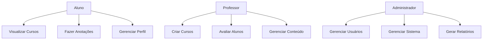
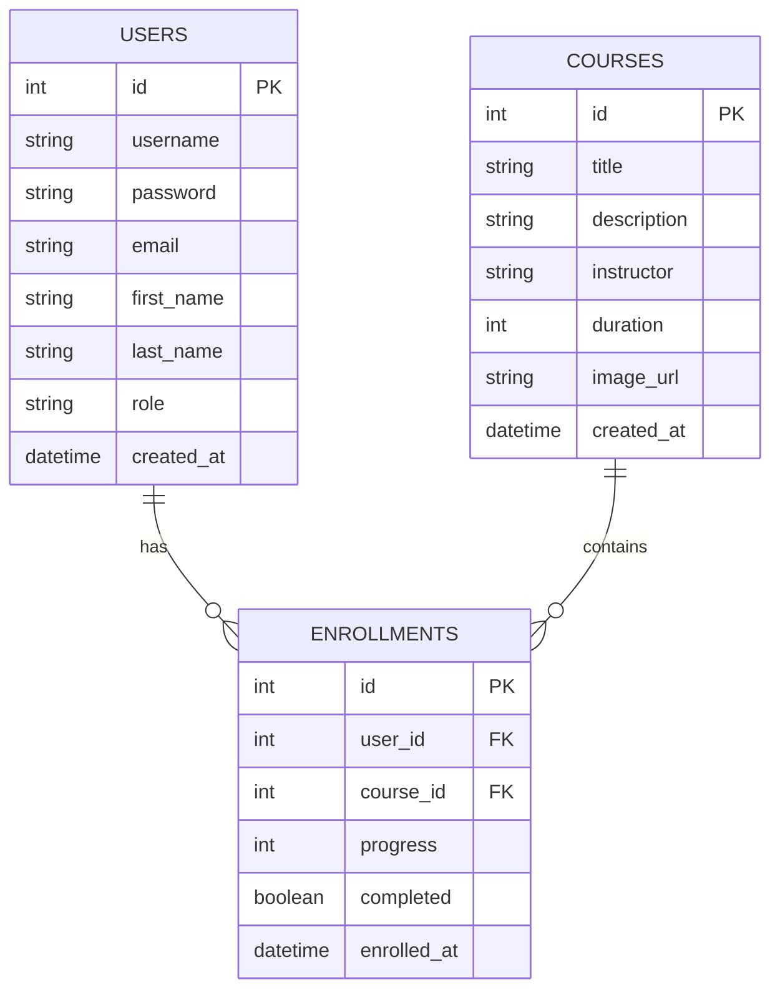

# EduNotas - Sistema de Gerenciamento de Notas Educacionais

## 📋 Sobre
EduNotas é uma aplicação web para gerenciamento de notas e cursos educacionais, permitindo que professores e alunos organizem e compartilhem anotações de forma eficiente.

## 📦 Instalação e Execução

1. Clone o repositório

2. Instale as dependências:
```bash
npm install
```

3. Configure as variáveis de ambiente:
   - Crie um arquivo `.env` na raiz do projeto
   - Adicione as seguintes variáveis:
```env
DATABASE_URL=sqlite://./data.db
MONGODB_URI=mongodb://localhost:27017/edunotes
SESSION_SECRET=your-secret-key
```

4. Inicie o servidor de desenvolvimento:
```bash
npm run dev
```

5. Acesse a aplicação em: `http://localhost:5000`

## 📚 Documentação API

### Swagger
A documentação da API está disponível em: `http://localhost:5000/api-docs`

## 📊 Diagramas

### Diagrama de Caso de Uso


### Modelo Relacional (SQLite)



### Modelo de Documentos (MongoDB)

```javascript
// Modelo de Notas (Notes)
{
  _id: ObjectId,
  userId: Number,
  courseId: Number,
  title: String,
  content: String,
  tags: [String],
  createdAt: Date,
  updatedAt: Date
}
```

## 🗃️ Estrutura do Banco de Dados

### Banco Relacional (SQLite)

1. **Users (Usuários)**
   - Gerenciamento de usuários do sistema
   - Tipos: Aluno, Professor, Administrador
   - Campos: id, username, password, email, first_name, last_name, role

2. **Courses (Cursos)**
   - Cadastro de cursos disponíveis
   - Campos: id, title, description, instructor, duration, image_url

3. **Enrollments (Matrículas)**
   - Relacionamento entre alunos e cursos
   - Campos: id, user_id, course_id, progress, completed

### Banco de Documentos (MongoDB)

1. **Notes (Anotações)**
   - Armazena as anotações dos alunos
   - Organização flexível com tags
   - Relacionamento com users e courses

## 🚀 Funcionalidades

- 👤 Autenticação de usuários
- 📚 Gerenciamento de cursos
- 📝 Sistema de anotações
- 👥 Gerenciamento de usuários
- 📊 Relatórios e estatísticas
- 🏷️ Organização por tags

## 💻 Tecnologias

- Frontend:
  - React
  - TypeScript
  - TailwindCSS
  - Shadcn/ui
  - React Query

- Backend:
  - Node.js
  - Express
  - SQLite
  - MongoDB
  - TypeScript

## 📄 Licença

Este projeto está sob a licença MIT.
